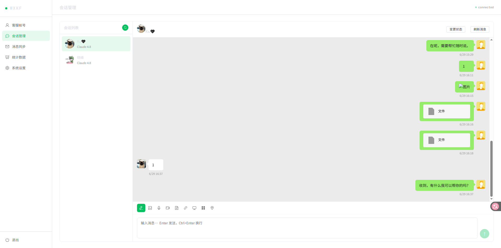

# 微信客服 AI 助手 (WxKF Bot)

基于 Cloudflare Worker 构建的微信客服智能机器人，集成 OpenAI 兼容 API，支持多轮对话、管理后台、关键词 Webhook 触发等功能。

[](https://deploy.workers.cloudflare.com/?url=https://github.com/bestk/wxkfbot)



## 功能特点

- 基于 Cloudflare Worker，无需服务器，全球边缘部署
- 集成 OpenAI 兼容 API（支持 GPT、DeepSeek 等模型）
- 微信客服消息接收与自动回复，支持多轮对话上下文
- 内置消息加解密，完整对接企业微信回调
- 使用 Cloudflare KV 存储会话历史和配置
- 可视化管理后台（客服帐号、会话、消息、统计、系统设置）
- 关键词匹配触发 Webhook（支持精确/包含/正则，自定义请求体和变量替换）
- AI 模型/Base URL/API Key 可在管理后台动态配置，无需重新部署

## 管理后台

内置 Web 管理面板，部署后访问 `https://your-worker.workers.dev/admin` 即可使用。

功能模块：

- **客服帐号** — 查看、添加、修改、删除微信客服帐号，获取客服链接
- **会话管理** — 实时查看会话列表，聊天窗口支持富媒体消息（图片/语音/视频/文件/链接/位置），支持手动回复和消息撤回
- **消息同步** — 同步微信客服历史消息
- **统计数据** — 按客服帐号查看统计
- **系统设置** — AI 模型配置、系统提示词、关键词 Webhook 规则

## 快速开始

### 配置要求

- Cloudflare 账号
- [微信企业号客服配置](./WECOM.md)
- OpenAI 兼容 API 密钥
- 加密服务部署（用于消息加解密）

### 部署步骤

#### 一键部署（推荐）

点击上方 "Deploy to Cloudflare Workers" 按钮，按提示操作。

#### 手动部署

```bash
git clone https://github.com/bestK/wxkfbot.git
cd wxkfbot
npm install
```

配置环境变量：

- 复制 `wrangler.toml.example` 为 `wrangler.toml`
- 填写微信企业号配置（WECHAT_*）、OpenAI 配置（OPENAI_*）、KV 命名空间

创建 KV 命名空间：

```bash
wrangler kv:namespace create "CONVERSATIONS"
wrangler kv:namespace create "MESSAGE_TRACKER"
```

将生成的 ID 填入 `wrangler.toml`，然后部署：

```bash
wrangler deploy
```

### 微信配置

在企业微信管理后台设置接收消息的服务器地址：

- URL：`https://your-worker.your-subdomain.workers.dev`
- Token：与 `WECHAT_KF_TOKEN` 一致
- EncodingAESKey：与 `WECHAT_KF_ENCODING_AES_KEY` 一致

## 环境变量

| 变量名 | 说明 | 必填 |
| --- | --- | --- |
| WECHAT_CORP_ID | 企业微信 CorpID | 是 |
| WECHAT_KF_SECRET | 客服密钥 | 是 |
| WECHAT_KF_TOKEN | 消息校验 Token | 是 |
| WECHAT_KF_ENCODING_AES_KEY | 消息加解密 Key | 是 |
| OPENAI_API_KEY | OpenAI API 密钥 | 是 |
| OPENAI_BASE_URL | API 地址（默认 https://api.openai.com） | 否 |
| OPENAI_MODEL | 模型名称（默认 gpt-3.5-turbo） | 否 |
| OPENAI_TIMEOUT | 请求超时 ms（默认 30000） | 否 |
| SYSTEM_PROMPT | AI 系统提示词 | 否 |
| CRYPTO_SERVICE_URL | 加密服务地址 | 是 |
| ADMIN_KEY | 管理后台访问密钥 | 否 |

> AI 模型、Base URL、API Key、系统提示词均可在管理后台动态修改，KV 中的配置优先于环境变量。

## 关键词 Webhook

在管理后台「系统设置」中配置关键词触发规则：

- 匹配方式：精确匹配、包含、正则表达式
- 请求方法：GET / POST
- Content-Type：JSON / Form
- 自定义请求体模板，支持变量替换

可用变量：

| 变量 | 说明 |
| --- | --- |
| `{{content}}` | 用户消息内容 |
| `{{external_userid}}` | 用户 ID |
| `{{open_kfid}}` | 客服 ID |
| `{{msgid}}` | 消息 ID |
| `{{keyword}}` | 匹配的关键词 |
| `{{timestamp}}` | 触发时间戳 |

GET 请求时变量可用于 URL 参数，POST 请求时用于请求体模板。

## 项目结构

```
wxkfbot/
├── index.js            # 主入口，路由和业务逻辑
├── config.js           # AI 配置管理
├── clients.js          # OpenAI / 微信 API 客户端
├── conversation.js     # 多轮对话管理
├── crypto.js           # 消息加解密
├── message-tracker.js  # 消息去重跟踪
├── response.js         # 统一响应格式
├── kf-management.js    # 微信客服管理 API 封装
├── kf-routes.js        # 客服管理路由处理
├── admin.js            # 管理后台（构建产物）
├── admin/              # 管理后台源码（Vue 3 + Element Plus）
│   └── src/
│       ├── App.vue
│       ├── api.ts
│       └── panels/    # AccountPanel, SessionPanel, MessagePanel, StatisticsPanel, SettingsPanel
└── scripts/
    └── build-admin.mjs # 前端构建脚本
```

## 开发

```bash
# 前端开发
cd admin && npm run dev

# Worker 本地调试
wrangler dev

# 构建管理后台
cd admin && npm run build && cd .. && node scripts/build-admin.mjs

# 部署
wrangler deploy
```

### 加密服务

由于 Cloudflare Worker 的 Crypto API 兼容性限制，消息加解密通过独立的 Deno 服务处理：

1. 使用 `wecom_crypto_deno.ts` 部署到 Deno Deploy
2. 将服务地址配置为 `CRYPTO_SERVICE_URL`

## 许可证

MIT License

## 链接

- 项目地址：[github.com/bestK/wxkfbot](https://github.com/bestK/wxkfbot)
- 问题反馈：[Issues](https://github.com/bestK/wxkfbot/issues)
